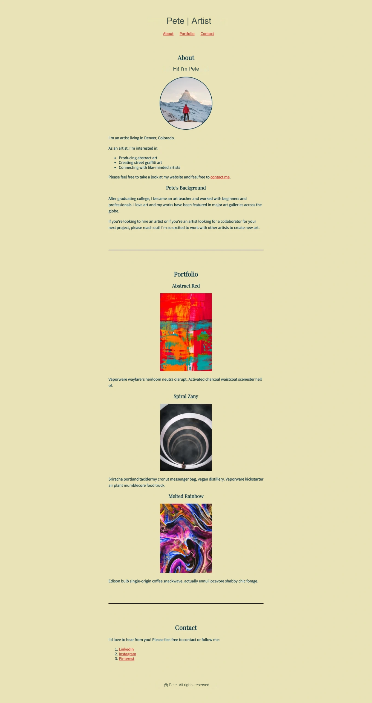
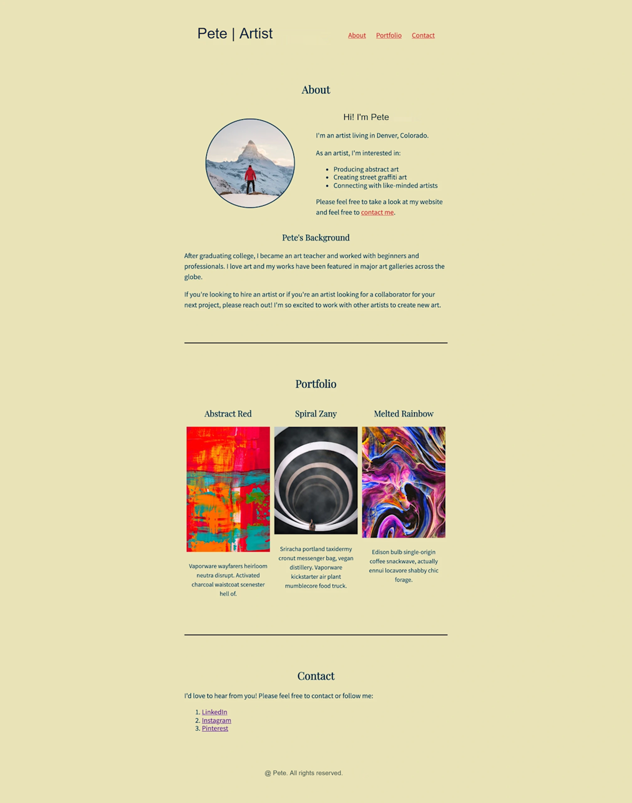
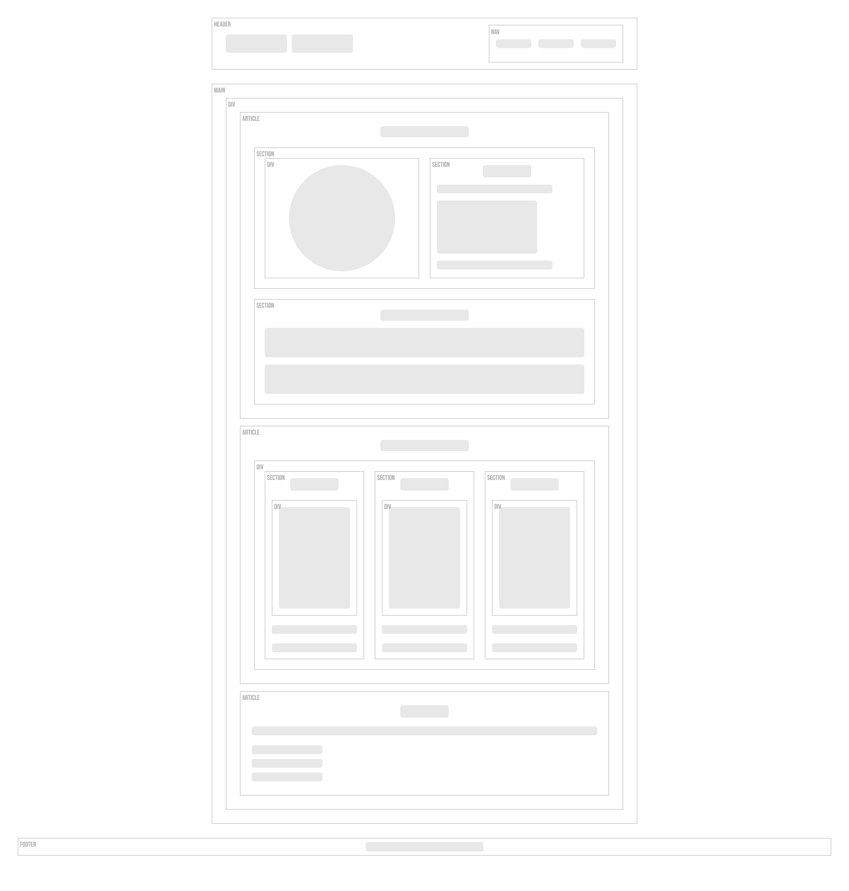
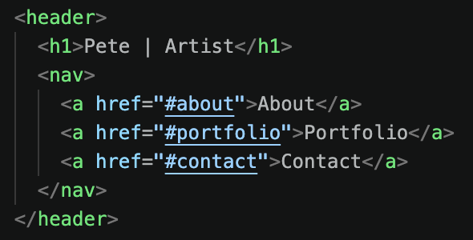
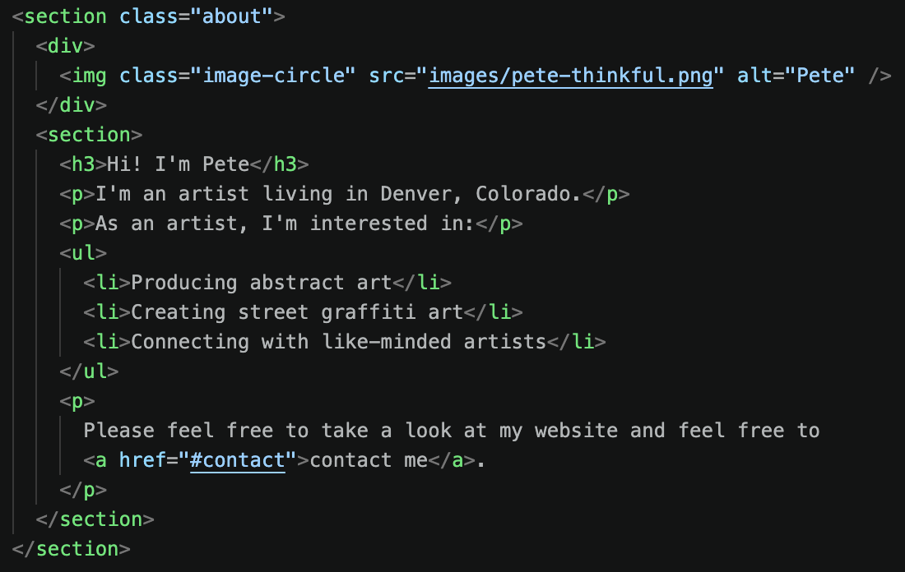
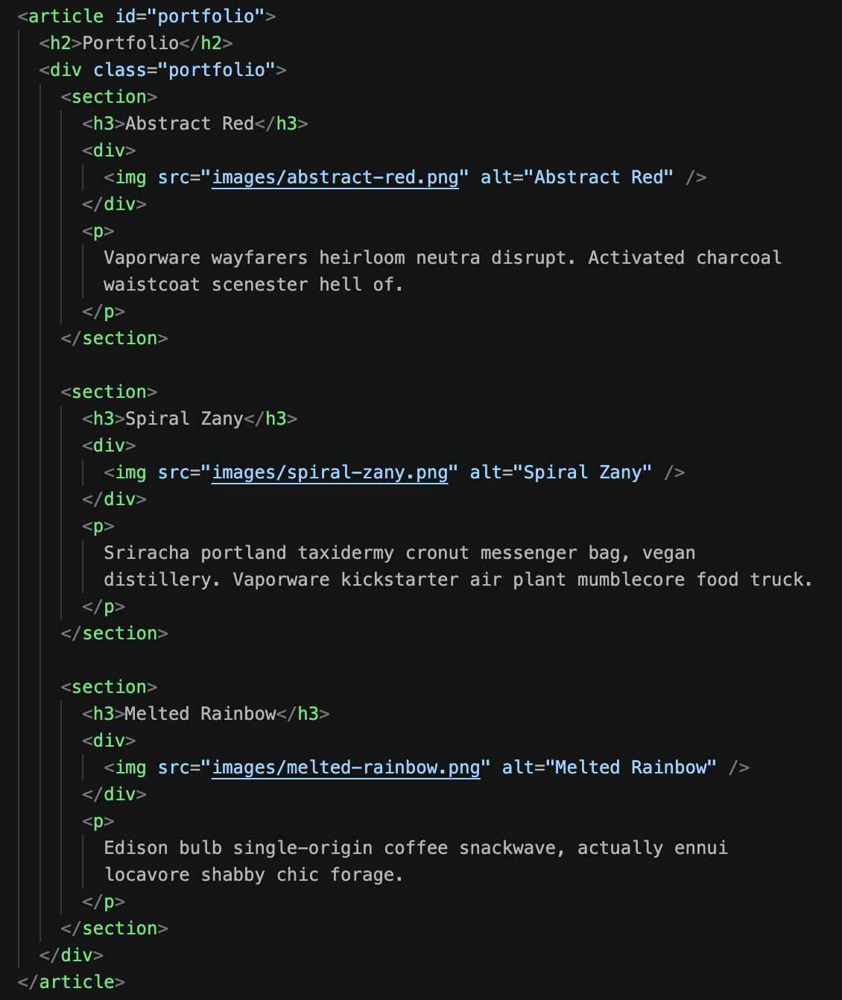
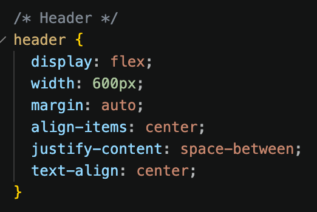
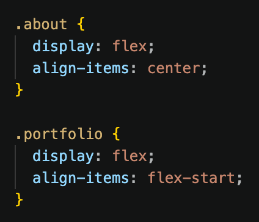

# Pete's Portfolio Redesign
An update to Pete Thinkful's online portfolio 

## Project Description
The project is a hypothetical design update to a single page web portfolio for an artist named Pete. The content in the header, about section, and portfolio section have been updated using CSS Flexible Box Layout. The page is built using basic HTML/CSS that was coded with Visual Studio Code.

## Design & Implementation Process

### Implementation Plan:
1. Used Figma to create an updated version of the wireframe based on the redesigned mockup.
2. Fork and clone the provided repository to local machine.
3. Use VSCode to update the structure of the HTML for the appropriate sections.
4. Reformat the sections using CSS Flexbox.
5. Use W3C Markup Validation Serivce to validate and debug code.

### Original Mockup

### Revised Mockup

### Revised Wireframe

## Design Trade-offs
This is a very simple single page website, so there were no major trade-offs that I needed to make in the design to fulfill the requirements of the project.

## AI Tool Disclosure
**CodeGPT** Used for inline code suggestions and auto complete. 

## Key Decisions
1. For each of the updated sections, `display: flex;` is used with the default direction so that the content is displayed in a row.
2. The `<nav>` section is placed inside the `<header>`. The header section width is set to 600px to align with the rest of the content of the page. For the flexbox, `align-items: center;` and `justify-content: space between;` are used to format the content within the container for desired alignment.
3. The image `
` and the first paragraph `<section>` in the About section are both wrapped in a `<section>` container. `align-items: center;` is used to center align the image with the introductory paragraph. 
4. In the Portfolio section, the content for the three art pieces are placed in `<section>` containers. All three are wrapped in a `
` using `align-items: flex-start;` to top align each piece within the section. The font-size for the art descriptions have been reduced to 14pt to better accommodate the space.

## Challenges & Debugging
I did not experience any significant challenges or debugging while updating this webpage.

## GitHub Commit History
(https://github.com/marcusdavisjr/starter-pete-thinkful-portfolio/commits/main)

## Development Screenshots

**HTML**

*****

**CSS**

